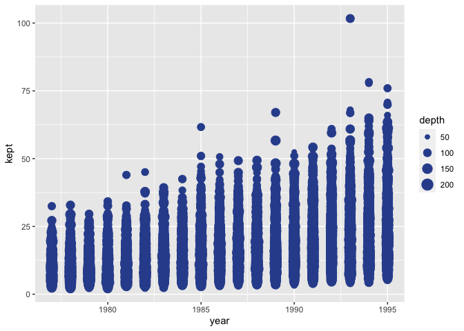

Visualizing Star Wars fishers
================
Gavin Fay <br> Acknowledgements: Mine Çetinkaya-Rundel

### Load in and have a look at the star wars fisher logbook data.

``` r
logbook <- read_csv("sw_fdd_logbook.csv")
```

    ## 
    ## ── Column specification ─────────────────────────────────────────────────────────────────────────────────
    ## cols(
    ##   year = col_double(),
    ##   vessel = col_character(),
    ##   world = col_character(),
    ##   quarter = col_double(),
    ##   towmin = col_double(),
    ##   depth = col_double(),
    ##   kept = col_double(),
    ##   height = col_double(),
    ##   mass = col_double(),
    ##   species = col_character(),
    ##   starship = col_character()
    ## )

``` r
glimpse(logbook)
```

    ## Rows: 152,000
    ## Columns: 11
    ## $ year     <dbl> 1977, 1977, 1977, 1977, 1977, 1977, 1977, 1977, 1977, 1977, 1977, 1977, 1977, 1977, 19…
    ## $ vessel   <chr> "Sebulba", "Lobot", "Barriss Offee", "Finn", "Jocasta Nu", "Mon Mothma", "Lando Calris…
    ## $ world    <chr> "Haruun Kal", "Haruun Kal", "Haruun Kal", "Haruun Kal", "Haruun Kal", "Haruun Kal", "H…
    ## $ quarter  <dbl> 1, 1, 1, 1, 1, 1, 1, 1, 1, 1, 1, 1, 1, 1, 1, 1, 1, 1, 1, 1, 1, 1, 1, 1, 1, 1, 1, 1, 1,…
    ## $ towmin   <dbl> 42.16495, 46.81169, 50.59232, 32.79854, 30.86095, 43.63696, 52.48207, 51.41123, 60.017…
    ## $ depth    <dbl> 105.10010, 84.23955, 116.58324, 114.03918, 115.41286, 111.52167, 145.45374, 97.43148, …
    ## $ kept     <dbl> 8.811933, 7.640126, 13.346137, 7.630187, 9.351864, 5.175822, 5.584466, 5.252058, 6.674…
    ## $ height   <dbl> 112, 175, 166, NA, 167, 150, 177, 198, 216, 157, 196, 180, 168, 191, 183, 94, 165, 163…
    ## $ mass     <dbl> 40.0, 79.0, 50.0, NA, NA, NA, 79.0, 102.0, 159.0, NA, 66.0, 80.0, 55.0, 90.0, 78.2, 45…
    ## $ species  <chr> "Dug", "Human", "Mirialan", "Human", "Human", "Human", "Human", "Besalisk", "Kaleesh",…
    ## $ starship <chr> "Belbullab-22 starfighter", "Naboo Royal Starship", "Belbullab-22 starfighter", "Slave…

``` r
#skim(logbook)
```

### Modify the following plot to change the color of all points to `"pink"`.

``` r
ggplot(logbook, 
       aes(x = year, y = kept, color = vessel, size = depth)) +
  geom_point(color = "#30509C")
```

<!-- -->

### Add labels for title, x and y axes, and size of points. Uncomment to see the effect.

``` r
ggplot(logbook, 
       aes(x = year, y = kept, color = vessel, size = depth)) +
  geom_point(color = "#30509C") +
  labs(
    #title = "___",
    #x = "___", 
    #y = "___",
    #___
    )
```

<!-- -->

### Pick a categorical variable from the data set and make a bar plot of its distribution.

(A little bit of starter code is provided below, and the code chunk is
set to not be evaluated with `eval = FALSE` because the current code in
there is not valid code and hence the document wouldn’t knit. Once you
replace the code with valid code, set the chunk option to `eval = TRUE`,
or remove the `eval` option altogether since it’s set to `TRUE` by
default.)

``` r
ggplot(logbook, aes(___)) +
  geom___
```

### Pick a single numerical variable and make a histogram of it.

(This time no starter code is provided, you’re on your own!)

### Pick a numerical variable and a categorical variable and make a visualisation (you pick the type!) to visualise the relationship between the two variables. Along with your code and output, provide an interpretation of the visualisation.

### Pick two categorical variables and make a visualisation to visualise the relationship between the two variables. Along with your code and output, provide an interpretation of the visualisation.

### Pick two numerical variables and two categorical variables and make a visualisation that incorportes all of them and provide an interpretation with your answer.
