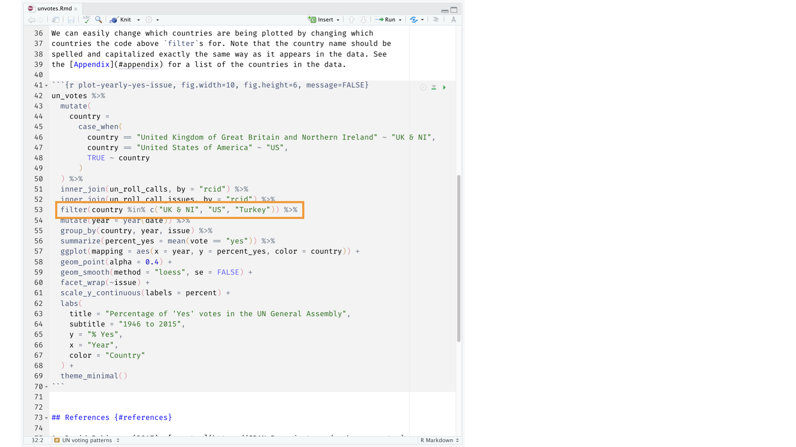

```{r child = "../setup.Rmd"}
```

```{r packages, echo=FALSE, message=FALSE, warning=FALSE}
library(tidyverse)
library(emo)
```

class: middle

# Hello world!

---

## Data science

.pull-left-wide[
- These workshops are on introduction to data analysis in R, with an emphasis on skills for analyzing and modeling fishery dependent data to perform CPUE standardization.
]

.pull-left-wide[
**Q - What data science background does this workshop assume?**  
A - None to slim.
]

---

class: middle

# Software

---

```{r echo=FALSE, out.width="75%", fig.align="left"}
knitr::include_graphics("img/excel.png")
```

---

```{r echo=FALSE, out.width="50%", fig.align="left"}
knitr::include_graphics("img/r.png")
```

---

```{r echo=FALSE, out.width="73%", fig.align="left"}
knitr::include_graphics("img/rstudio.png")
```

---

class: middle

# Data science life cycle

---

```{r echo=FALSE, out.width="90%", fig.align="left"}
knitr::include_graphics("img/data-science-cycle/data-science-cycle.001.png")
```

---

```{r echo=FALSE, out.width="90%", fig.align="left"}
knitr::include_graphics("img/data-science-cycle/data-science-cycle.002.png")
```

---

```{r echo=FALSE, out.width="90%", fig.align="left"}
knitr::include_graphics("img/data-science-cycle/data-science-cycle.003.png")
```

---

```{r echo=FALSE, out.width="90%", fig.align="left"}
knitr::include_graphics("img/data-science-cycle/data-science-cycle.004.png")
```

---

```{r echo=FALSE, out.width="90%", fig.align="left"}
knitr::include_graphics("img/data-science-cycle/data-science-cycle.005.png")
```

---

```{r echo=FALSE, out.width="90%", fig.align="left"}
knitr::include_graphics("img/data-science-cycle/data-science-cycle.006.png")
```


---

.pull-left[
```{r echo=FALSE, out.width="75%", fig.align="left"}
knitr::include_graphics("img/google-trend-index.png")
```
]
.pull-right[
```{r echo=FALSE, out.width="90%", fig.align="right"}
knitr::include_graphics("img/data-science-cycle/data-science-cycle.006.png")
```
```{r echo=FALSE}
travel <- tribble(
  ~date,              ~season,
  "23 January 2017",  "winter",
  "4 March 2017",     "spring",
  "14 June 2017",     "summer",
  "1 September 2017", "fall",
  "...", "..."
)
travel
```
]


<!-- ```{r echo=FALSE, out.width="90%", fig.align="left"} -->
<!-- knitr::include_graphics("img/data-science-cycle/data-science-cycle.007.png") -->
<!-- ``` -->

<!-- --- -->

<!-- ```{r echo=FALSE, out.width="90%", fig.align="left"} -->
<!-- knitr::include_graphics("img/data-science-cycle/data-science-cycle.008.png") -->
<!-- ``` -->

<!-- --- -->

<!-- ```{r echo=FALSE, out.width="90%", fig.align="left"} -->
<!-- knitr::include_graphics("img/data-science-cycle/data-science-cycle.009.png") -->
<!-- ``` -->

<!-- --- -->

<!-- ```{r echo=FALSE, out.width="85%", fig.align="left"} -->
<!-- knitr::include_graphics("img/unvotes/unvotes.gif") -->
<!-- ``` -->

<!-- --- -->

<!-- class: middle -->

<!-- # Let's dive in! -->

<!-- --- -->

<!-- background-image: url("img/unvotes/unvotes-01.jpeg") -->

<!-- --- -->

<!-- class: inverse -->

<!-- ```{r echo=FALSE, out.width="100%"} -->
<!-- knitr::include_graphics("img/unvotes/unvotes-02.jpeg") -->
<!-- ``` -->

<!-- --- -->

<!-- class: inverse -->

<!-- ```{r echo=FALSE, out.width="100%"} -->
<!-- knitr::include_graphics("img/unvotes/unvotes-03.jpeg") -->
<!-- ``` -->

<!-- --- -->

<!-- class: inverse -->

<!-- ```{r echo=FALSE, out.width="100%"} -->
<!-- knitr::include_graphics("img/unvotes/unvotes-04.jpeg") -->
<!-- ``` -->

<!-- --- -->

<!-- class: inverse -->

<!-- ```{r echo=FALSE, out.width="100%"} -->
<!-- knitr::include_graphics("img/unvotes/unvotes-05.jpeg") -->
<!-- ``` -->

<!-- --- -->

<!-- class: inverse -->

<!-- ```{r echo=FALSE, out.width="100%"} -->
<!-- knitr::include_graphics("img/unvotes/unvotes-06.jpeg") -->
<!-- ``` -->

<!-- --- -->

<!-- class: inverse -->

<!-- ```{r echo=FALSE, out.width="100%"} -->
<!-- knitr::include_graphics("img/unvotes/unvotes-07.jpeg") -->
<!-- ``` -->

<!-- --- -->

<!-- class: inverse -->

<!-- ```{r echo=FALSE, out.width="90%"} -->
<!-- knitr::include_graphics("img/unvotes/unvotes-08.jpeg") -->
<!-- ``` -->

<!-- --- -->

<!-- class: inverse -->

<!-- ```{r echo=FALSE, out.width="90%"} -->
<!-- knitr::include_graphics("img/unvotes/unvotes-09.jpeg") -->
<!-- ``` -->

<!-- --- -->

<!-- class: inverse -->

<!-- ```{r echo=FALSE, out.width="90%"} -->
<!--  -->
<!-- ``` -->

<!-- --- -->

<!-- class: inverse -->

<!-- ```{r echo=FALSE, out.width="90%"} -->
<!-- knitr::include_graphics("img/unvotes/unvotes-11.jpeg") -->
<!-- ``` -->

<!-- --- -->

<!-- class: inverse -->

<!-- ```{r echo=FALSE, out.width="90%"} -->
<!-- knitr::include_graphics("img/unvotes/unvotes-12.jpeg") -->
<!-- ``` -->

<!-- --- -->

<!-- class: inverse -->

<!-- ```{r echo=FALSE, out.width="100%"} -->
<!-- knitr::include_graphics("img/unvotes/unvotes-13.jpeg") -->
<!-- ``` -->

<!-- --- -->

<!-- class: inverse -->

<!-- ```{r echo=FALSE, out.width="100%"} -->
<!-- knitr::include_graphics("img/unvotes/unvotes-14.jpeg") -->
<!-- ``` -->

<!-- --- -->

<!-- .center[ -->
<!-- .large[ -->
<!-- [minecr.shinyapps.io/unvotes](https://minecr.shinyapps.io/unvotes/) -->
<!-- ] -->
<!-- ] -->

<!-- ```{r echo=FALSE, out.width="65%"} -->
<!-- knitr::include_graphics("img/unvotes/unvotes-15.png") -->
<!-- ``` -->
